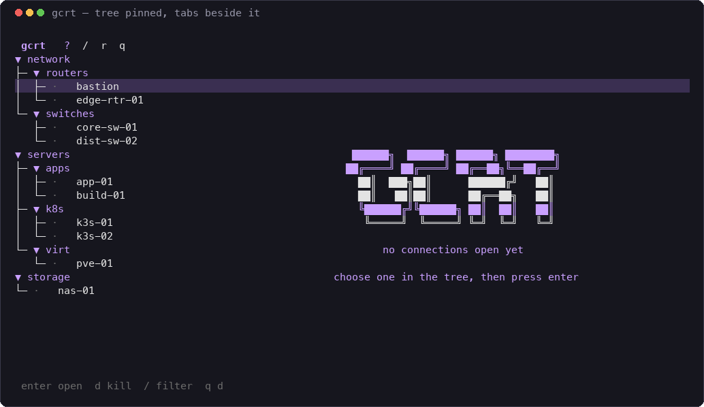
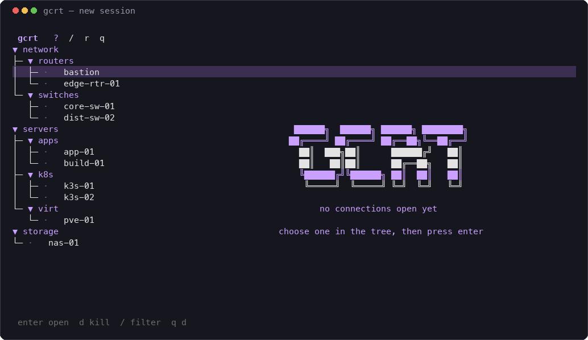
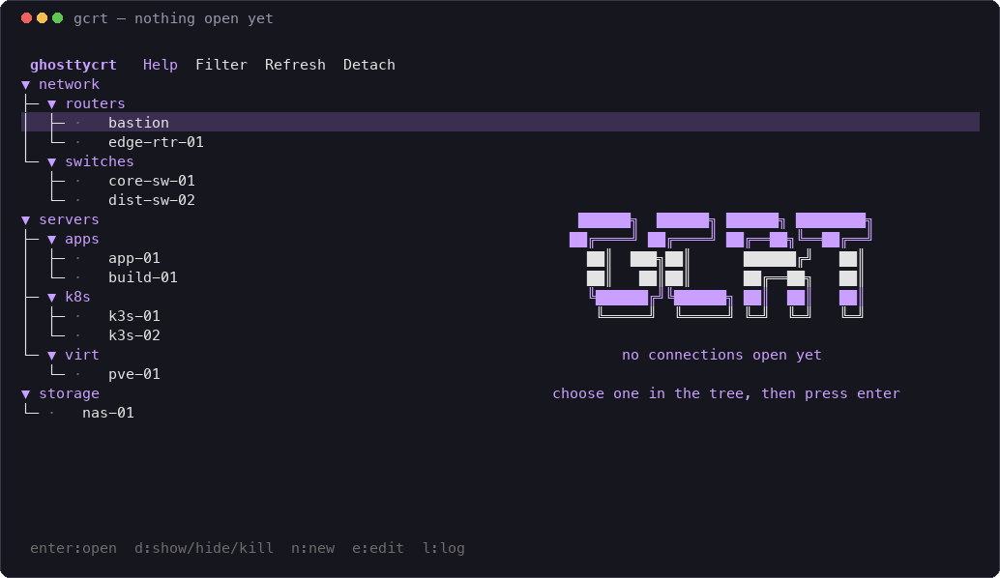

# ghosttycrt

A terminal session manager for network gear and servers — SSH, serial console,
session tree, and logging in one TUI, hosted on Ghostty.

Replaces SecureCRT for the parts that actually get used daily, and stays out of
the terminal-emulator business because Ghostty already does that better.

**Status:** M1 complete, plus `workspace` mode — **this is already a SecureCRT
replacement for SSH.** `enter` creates or reattaches a tmux session and hands
you the terminal; the session outlives `gcrt` and Ghostty. With
`display_mode = "workspace"` the tree lives in a tmux window of its own and
every connection gets its own tab (`workspace_layout = "tabs"`), or the tree
stays pinned on the left with the tabs beside it (`"sidebar"`), or connections
tile as panes when you want several visible at once (`"split"`). The top row is a clickable menu bar; `?` or the
`Help` item opens the full key and command list. Sessions can be created,
edited, duplicated, pinned and removed from the UI, with atomic writes to
`sessions.toml`. Serial and logging are next
([`spec/09-milestones.md`](spec/09-milestones.md)).

## Screenshots

The sidebar layout — the tree stays put, connections are tabs beside it:



Right-clicking a session opens its menu, where it can be closed:


Sessions are added and edited in place; saving writes the file atomically:



`?` brings up every key and command:


With nothing open, the content pane says so:



These are generated by `scripts/screenshots.sh`, which drives a real `gcrt`
against a throwaway config with invented hosts and a stand-in for `ssh` — so no
real session appears in them.

## Build and run

```
go build ./cmd/gcrt          # or: go run ./cmd/gcrt tui
go run ./cmd/gcrt check      # validate config + sessions, no TUI
go run ./cmd/gcrt import securecrt           # dry run
go run ./cmd/gcrt import securecrt --write   # replaces sessions.toml, after a backup
go test ./...
```

`gcrt` reads `~/.config/ghosttycrt/{config.toml,sessions.toml}`. Point it
elsewhere while trying it out with `-config-dir examples`.

`gcrt import securecrt` converts an existing SecureCRT configuration — its
folder tree becomes the group tree, and stored passwords are never imported
(sessions that had one are listed so you can add a credential reference).

## The shape of it

```
Ghostty  →  gcrt (TUI session manager)  →  tmux (session host)  →  ssh / picocom
```

- **Ghostty** renders. Native tabs/splits on macOS; any window on Linux.
- **gcrt** is the session tree, the launcher, and the log switch.
- **tmux** is the portable backbone: same on macOS and Linux, survives Ghostty
  quitting or the laptop sleeping, and gives us per-session logging for free.
- Credentials come from **Infisical** or **Vaultwarden** at connect time and are
  never written to disk.

## Non-goals

SFTP/SCP panels, X/Y/Zmodem, Wyse/SCO emulation, RDP/VNC, a password vault of
our own, AI. See `spec/01-overview.md`.

## Prerequisites

| | |
|---|---|
| Ghostty | 1.3.0+ (1.3.1 verified) |
| tmux | installed (3.7c) |
| Go | 1.26+ (verified go1.26.5 darwin/arm64) |
| picocom | installed — serial only |
| infisical CLI | credential provider (installed at `~/.local/bin/infisical`) |
| rbw | credential provider for Vaultwarden — `brew install rbw` |

## Spec index

| File | Covers |
|---|---|
| [`spec/README.md`](spec/README.md) | index, decisions, open questions |
| [`spec/01-overview.md`](spec/01-overview.md) | problem, goals, non-goals, users |
| [`spec/02-architecture.md`](spec/02-architecture.md) | layers, why tmux, process model, paths |
| [`spec/03-data-model.md`](spec/03-data-model.md) | config, session records, state, imports |
| [`spec/04-transports.md`](spec/04-transports.md) | ssh, serial, telnet, local; attach/detach |
| [`spec/05-credentials.md`](spec/05-credentials.md) | Infisical, Vaultwarden, askpass, macros |
| [`spec/06-logging.md`](spec/06-logging.md) | pipe-pane, timestamps, rotation, viewer |
| [`spec/07-tui.md`](spec/07-tui.md) | views, keybinds, status, theming |
| [`spec/08-acceptance.md`](spec/08-acceptance.md) | acceptance criteria and test list |
| [`spec/09-milestones.md`](spec/09-milestones.md) | M0–M6 build order |
